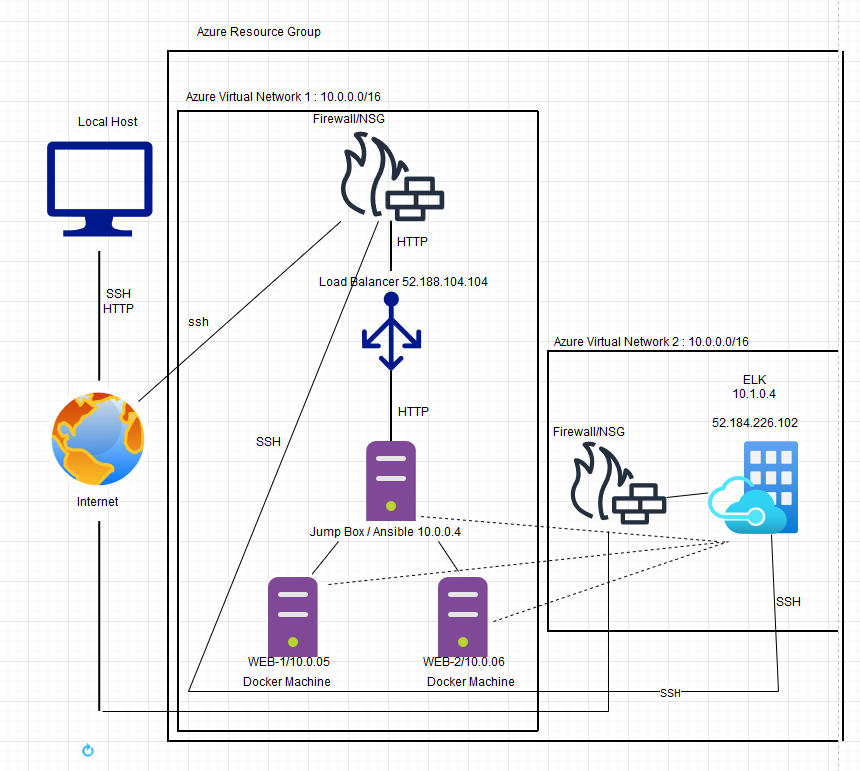

## Automated ELK Stack Deployment

The files in this repository were used to configure the network depicted below.

These files have been tested and used to generate a live ELK deployment on Azure. They can be used to either recreate the entire deployment pictured above. Alternatively, select portions of the filebeat-playbook.yml file may be used to install only certain pieces of it, such as Filebeat.

  [filebeat-playbook.yml](https://github.com/kanon333/ELK-PROJECT/tree/main/Ansible)
  
[install-elk.yml](https://github.com/kanon333/ELK-PROJECT/blob/main/Ansible/install-elk.txt)

This document contains the following details:
- Description of the Topologu
- Access Policies
- ELK Configuration
  - Beats in Use
  - Machines Being Monitored
- How to Use the Ansible Build

### Description of the Topology

The main purpose of this network is to expose a load-balanced and monitored instance of DVWA, the D*mn Vulnerable Web Application.

Load balancing ensures that the application will be reliable , in addition to restricting unauthorized users  to the network.
- What aspect of security do load balancers protect? What is the advantage of a jump box?_
    - A load balancer defends against the possiblity of a DDoS attack, by distribuing traffic  throught the network. Load balncers can also be configured to only allow access to authorized users adding another layer of security to the network.
    - A jump box requires you to connect to it before preforming any administrative tasks on the system, ensuring a secure enviroment.

Integrating an ELK server allows users to easily monitor the vulnerable VMs for changes to the logs and system traffic

 -What does Filebeat watch for?_
    - Filebeat watches for log files or locations and collects log events.
- What does Metricbeat record?_
    - Metricbeat is a lightweight shipper that you can install on your servers to periodically collect metrics from the operating system and from the services running on the server.
The configuration details of each machine may be found below.
_Note: Use the [Markdown Table Generator](http://www.tablesgenerator.com/markdown_tables) to add/remove values from the table_.

| Name     | Function | IP Address | Operating System |
|----------|----------|------------|------------------|
| Jump Box | Gateway  | 10.0.0.4   | Linux            |
| WEB-1    | Server   | 10.0.0.5   | Linux            |
| WEB-2    | Server   | 10.0.0.6   | Linux            |
| ELK      | Server   | 10.1.0.4   | Linux            |
### Access Policies

The machines on the internal network are not exposed to the public Internet. 

Only the Jump Box machine can accept connections from the Internet. Access to this machine is only allowed from the following IP addresses:
<!--- _TODO: Add whitelisted IP addresses_-->
    - Local host IP is the only IP allowed to connect to this machine remotely.

Machines within the network can only be accessed by the Jump Box.
<!--- _TODO: Which machine did you allow to access your ELK VM? What was its IP address?_-->
    - The Jump box (52.188.104.104) is the only Machine allowed to access the ELK VM.

A summary of the access policies in place can be found in the table below.

| Name     | Publicly Accessible | Allowed IP Addresses  |
|----------|---------------------|-----------------------|
| Jump Box | yes                 | Local Host            |
| WEB-1    | NO                  |  10.0.0.4  10.1.0.4   |
| WEB-2    | NO                  |  10.0.0.4  10.1.0.4   |
| ELK      | NO                  |  10.0.0.4             |

### Elk Configuration

Ansible was used to automate configuration of the ELK machine. No configuration was performed manually, which is advantageous because...
<!-- _TODO: What is the main advantage of automating configuration with Ansible?_-->
    -The main advantage of using ansible to automate my configurations was I didnt have to preform repetitive tasks to configure the VMs on the network. Only one play is need to configure all the machines.

<!--The playbook implements the following tasks:-->
<!-- _TODO: In 3-5 bullets, explain the steps of the ELK installation play. E.g., install Docker; download image; etc._-->
  * 

The following screenshot displays the result of running `docker ps` after successfully configuring the ELK instance.

### Target Machines & Beats
This ELK server is configured to monitor the following machines:
<!--- _TODO: List the IP addresses of the machines you are monitoring_-->
    - WEB-1(10.0.0.5)
    - WEB-2(10.0.0.6)

We have installed the following Beats on these machines:
<!--- _TODO: Specify which Beats you successfully installed_-->
    - Filebeat
These Beats allow us to collect the following information from each machine:
<!--- _TODO: In 1-2 sentences, explain what kind of data each beat collects, and provide 1 example of what you expect to see. E.g., `Winlogbeat` collects Windows logs, which we use to track user logon events, etc._-->
    - Filebeat collects logs and forword them to the specified loction(s) for indexing.

### Using the Playbook
In order to use the playbook, you will need to have an Ansible control node already configured. Assuming you have such a control node provisioned: 

SSH into the control node and follow the steps below:
- Copy the playbook file to /etc/ansible.
- Update the host file to include... The IP of the machine(s) you want the playbook to run on.
- Run the playbook, and navigate to the KIBANA URL to check that the installation worked as expected.

_TODO: Answer the following questions to fill in the blanks:_
- _Which file is the playbook? Where do you copy it?_ The filebeat-playbook.yml fiel is the playbook. You should copy it to the /etc/ansible directory in your docker VM.
- _Which file do you update to make Ansible run the playbook on a specific machine?  You should navigate to the /etc/ansible/host fiel on your docker VM and add the IP of the machine you want your playbook to run on. <!--How do I specify which machine to install the ELK server on versus which to install Filebeat on?_-->
- _Which URL do you navigate to in order to check that the ELK server is running? you will navigate to http://your_ELK_public_IP:5601/app/kibana

<!--_As a **Bonus**, provide the specific commands the user will need to run to download the playbook, update the files, etc._-->
